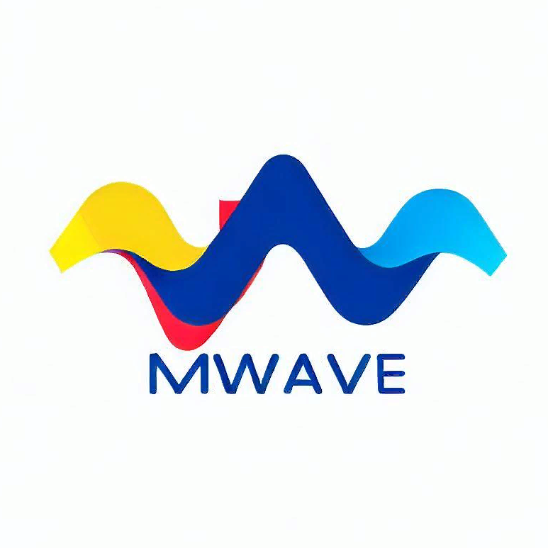

<p align="center">
    
</p>

# MatrixWave

   `MatrixWave` is a solution for the RTOS `Nuttx`, the purpose is:
   Provide functionality for working with matrices (multiplying two matrices)
   and transmitting matrices via SPI (Serial Peripheral Interface)

   The project includes:
   
   - User-space app `mwave`: Two matrix multiplication and transmission start
   - Upper-half driver`spi_wave`: Matrix serialization and transfer over SPI

## 1. Project Structure

   The repository is structured as follows:

   - **spi_wave**: This directory contains the driver for transmitting
     matrix over SPI.
     - `Makefile`: The makefile for building the driver.
     - `Make.defs`: The compiler definitions for building the driver.
     - `Kconfig`: The configuration file for the driver.
     - `matrix_serialization.c`: Source file implementing matrix serialization.
     - `...`: Other source files necessary for the driver.

   - **mwave**: This directory contains the application for matrix
     multiplication.
     - `Makefile`: The makefile for building the application.
     - `Make.defs`: The compiler definitions for building the application.
     - `Kconfig`: The configuration file for the application.
     - `...`: Other source files necessary for the application.

   - **tests**: This directory contains the unit tests for both the driver and
     the application. This includes:
     - `test_mwave.c`
     - `test_matrix_serialization.c`
     - `test_mt_spisend_driver.c`

## 2. How to Install
   The project is designed to work with the NuttX Real-Time Operating System.
   To install:
### 2.1. Clone Nuttx sources
   ...

### 2.2. Install MatrixWawe
   - Clone this repository
     ```
     $ git clone git@github.com:linxuil/matrixwave.git mwave
     ```
   - Copy the directories (`mt_spisend_driver` and `mwave`) into
     the `apps/math` directory of your NuttX installation.
   - Regenerate configuration
     The new module's folder, which we copied, will become visible only
     after the Kconfig files are updated.
     ```
     $ make apps_distclean       # Clear autogenerated files in apps dir
     $ make apps_preconfig       # Generate new files with new app links
     ```
   - Then, you can include the driver and application in your 
     build configuration
     ```
     $ make menuconfig
     ```
   - And compile NuttX as usual.
     Example - on linux host `-l` for config `sim:nsh` with activate py venv:
     ```
     $ ./tools/configure.sh -l sim:nsh
     $ source nuttx_venv/bin/activate     # Set you venv path
     $ make -j
     ```

## 3. How to Use
   - Launch NuttX and enter its shell.
     For example, use the following command to do it in the simulator.
     ```
     ./nuttx
     ```
   - Run `mwave` command
     ```
     nsh> mwave
            ...mwave output process: generated and multipl-on result matrix...
     ```
   - That's it - your result matrix has been sent via SPI.
